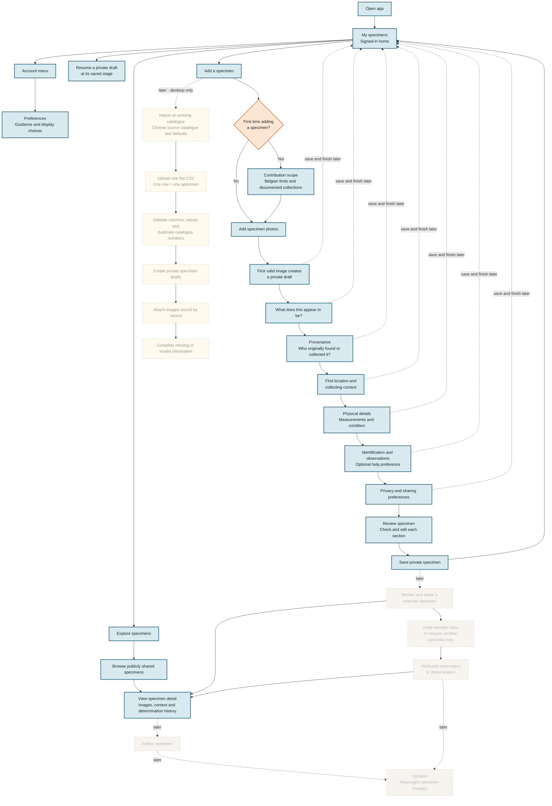

# Belgian Fossil Finds prototype flow



## Legend

- **Blue, solid:** Implemented in the current interactive prototype.
- **Orange, solid:** Implemented decision point.
- **Faded, dashed:** Agreed next MVP work that is not yet implemented.
- **Warm yellow, dashed:** Future desktop-only catalogue import.

# Current product model

```text
SIGNED-IN HOME
│
├── My specimens
│   ├── Needs information
│   │   └── Resume directly at the saved stage
│   ├── Ready for review
│   │   └── Open Review specimen
│   ├── Private specimens
│   │   └── Open Review specimen
│   └── Later: shared specimens
│
├── Explore specimens
│   ├── Browse publicly shared specimens
│   └── View specimen details
│
├── Account menu
│   ├── Workflow-guidance preference
│   ├── Image-guidance preference
│   └── Review contribution scope
│
└── Add a specimen
    │
    ├── First contribution only
    │   └── Contribution scope and eligibility guidance
    │
    └── Add specimen photos
        ├── Take a new photograph
        ├── Choose existing photographs
        ├── First valid image creates the private draft
        ├── Further images are added directly to that draft
        ├── Continue directly to specimen type
        └── Save and finish later returns to My specimens
                    │
                    ▼
SPECIMEN DOCUMENTATION
│
├── What does this appear to be?
│   └── Fossil / rock or mineral / collection item / not sure yet
│
├── Provenance
│   └── Original finder, collector, or collection history
│
├── Find location and collecting context
│
├── Physical details
│   └── Measurements and condition
│
├── Identification and observations
│   └── Optional suggested identification and help preference
│
├── Privacy and sharing preferences
│   ├── Private by default
│   └── Exact site details remain private
│
├── Review specimen
│   ├── Read-only summary of every meaningful section
│   ├── Direct Edit action for each existing screen
│   └── At least one image required for private save
│
└── Save private specimen
                    │
                    ▼
MY SPECIMENS
│
└── Private specimens
    └── Open Review specimen again
```

## Draft creation and image ownership

The mobile single-specimen route remains image-first.

A private draft is created only after the first supported, non-duplicate image is accepted. Opening the photo screen and leaving without an image creates nothing.

After draft creation, `SpecimenDraft.images` is the only owner of the selected files and preview URLs. Returning from specimen type to images edits that same array. Navigation and save-for-later actions do not recreate or transfer preview URLs.

Removing an image removes it from the active draft and revokes only that image’s preview URL. Removing the final image preserves the draft and all entered information, sets its resume stage to Images, and prevents continuation or private save until a replacement image is added. No native confirmation dialog is used.

## Save and resume behavior

Field changes are written to the active draft as they occur.

**Save and finish later** records the current domain-level stage and returns to My specimens. Selecting an incomplete draft resumes it directly at that stage. Selecting an entry that is Ready for review or already saved as a Private specimen opens Review specimen.

Opening Settings preserves the active draft and current flow screen. Closing Settings returns to the exact previous screen.

The current prototype stores drafts only in React memory. Refreshing the page loses unfinished drafts, files, preview URLs, and annotations. Only onboarding and guidance preferences use local storage.

## Review and private save

Completing privacy and sharing choices opens **Review specimen**. The review screen presents a read-only summary of images, type, provenance, find location, physical details, identification and observations, help preference, and privacy settings.

Each section has an Edit action that opens the relevant existing screen. Completing or backing out of that focused edit returns to Review with the same draft data and image ownership.

**Save private specimen** requires at least one image. It changes the local status to Private specimen, updates the modification time, keeps all data and images in local state, and returns to My specimens.

Saving privately does not publish the specimen, apply the future sharing preference, or expose exact locality data. The current prototype still loses all specimen data on browser refresh.

## Archived prototype routes

The earlier arbitrary batch-image grouping, image-route choice, workspace, and annotation-queue components are no longer imported or rendered by the active application.

Their source remains temporarily under `src/obsolete/` for historical reference. Their CSS is not included in the active application bundle.

Selecting several files in the normal specimen-photo screen means:

> These photographs are different views of one physical specimen.

It does not create several specimens and is not a bulk-import feature.

The future catalogue-import workflow is separate:

```text
Import an existing catalogue
→ Choose or describe the source catalogue
→ Upload one flat CSV
→ Validate columns and rows
→ One valid row creates one private draft
→ Attach images specimen by specimen
→ Resolve missing or invalid information
→ My specimens
```

The future catalogue import must not reuse the archived arbitrary-thumbnail grouping model.

## Product boundaries

The prototype deliberately excludes:

- marketplace or sales features;
- valuation requests;
- private messaging;
- reputation points;
- automatic or AI identification;
- a generic social feed;
- institutional data publication;
- production catalogue import;
- advanced moderator tooling.

The project documents fossil specimens connected to Belgium. It does not claim to represent the Belgian fossil community or any geological or palaeontological association.

## Recommended handoff architecture

```text
Frontend responsibility
────────────────────────────────
React PWA
UX and UI
Forms and validation
Responsive behavior
Accessibility
Frontend state
Mock service layer
API contracts
User-testing beta

Integration boundary
────────────────────────────────
findsService
authService
mediaService
determinationsService

Backend specialist responsibility
────────────────────────────────
Authentication
Database schema review
Access-control policies
Private-location protection
Image permissions
Moderation authority
Audit and security controls
Production deployment
```

## Frontend handoff point

The intended frontend beta includes:

- a complete responsive interface;
- the primary signed-in user journeys;
- realistic loading, empty, success, and error states;
- form validation;
- image preview and upload UX;
- multilingual-ready interface structure;
- accessibility;
- seeded specimen data;
- mock accounts and roles;
- mock determination requests;
- API contracts and TypeScript types;
- a development database or mock API;
- frontend tests;
- documented production-backend expectations.

## Production backend boundary

Production services require review and implementation by a suitably experienced backend developer. They include:

- registration and login security;
- password recovery;
- account deletion;
- authorization and role enforcement;
- specialist verification;
- row-level security policies;
- private exact-location protection;
- secure image access;
- moderation privileges;
- audit logging;
- rate limiting and abuse prevention;
- backups and recovery;
- data deletion and export workflows;
- security testing.
