```mermaid
flowchart TD
    OPEN["Open app"] --> HOME["My specimens<br/>Signed-in home"]

    %% Primary signed-in navigation
    HOME --> ADD["Add a specimen"]
    HOME --> QUEUE["Annotation queue<br/>Specimens needing information"]
    HOME --> EXPLORE["Explore specimens"]

    %% Public exploration
    EXPLORE --> BROWSE["Browse publicly shared specimens"]
    BROWSE --> DETAIL["View specimen detail<br/>Images, context and determination history"]

    %% One-specimen contribution flow
    ADD --> FIRST_TIME{"First time adding<br/>a specimen?"}
    FIRST_TIME -- Yes --> SCOPE["Contribution scope<br/>Belgian field finds and documented collections"]
    FIRST_TIME -- No --> PHOTOS["Add images for one specimen"]

    SCOPE --> PHOTOS
    PHOTOS --> DRAFT["Create private specimen draft<br/>Image association is complete"]
    DRAFT --> QUEUE

    %% Current shared annotation flow
    QUEUE --> ANNOTATE["Start documenting specimen"]
    ANNOTATE --> TYPE["What does this appear to be?<br/>Fossil, rock/mineral, artefact or unsure"]
    TYPE --> PROVENANCE["Provenance<br/>Who originally found it?"]
    PROVENANCE --> CONTEXT["Find location and collecting context"]
    CONTEXT --> MEASURE["Physical details<br/>Measurements and condition"]
    MEASURE --> DESCRIPTION["Identification, observations<br/>and help preference"]
    DESCRIPTION --> PRIVACY["Privacy and sharing preferences"]

    %% Current prototype endpoint versus next intended slice
    PRIVACY --> CURRENT_RETURN["Current prototype:<br/>return to annotation queue"]
    CURRENT_RETURN --> QUEUE

    PRIVACY -. "next MVP slice" .-> REVIEW["Review specimen"]
    REVIEW --> SAVE["Save private specimen"]
    SAVE --> HOME

    %% Future sharing and human collaboration
    SAVE -. "later" .-> SHARE["Review and share a selected specimen"]
    SHARE --> DETAIL
    SHARE --> REQUEST["Invite community input<br/>or request verified-specialist help"]
    REQUEST --> RESPONSE["Attributed observation<br/>or determination"]
    RESPONSE --> DETAIL

    DETAIL -. "later" .-> FOLLOW["Follow specimen"]
    FOLLOW -. "later" .-> UPDATES["Updates<br/>Changes to owned, followed or contributed-to specimens"]
    RESPONSE -. "later" .-> UPDATES

    %% Advanced desktop-only catalogue-import route
    ADD -. "later · desktop only" .-> CSV_SETUP["Import an existing catalogue<br/>Choose a source catalogue and defaults"]
    CSV_SETUP --> CSV_UPLOAD["Upload one flat CSV<br/>One row = one specimen"]
    CSV_UPLOAD --> CSV_VALIDATE["Validate columns, values and<br/>duplicate catalogue numbers"]
    CSV_VALIDATE --> CSV_DRAFTS["Create private specimen drafts"]
    CSV_DRAFTS --> IMAGE_MATCH["Attach images record by record<br/>Expected image count supports progress"]
    IMAGE_MATCH --> REVISION_QUEUE["Complete missing or invalid information"]
    REVISION_QUEUE --> QUEUE

    %% Styles
    classDef implemented fill:#d8e9f0,stroke:#10546f,color:#172229,stroke-width:2px;
    classDef decision fill:#fbe5d3,stroke:#d96f2d,color:#172229,stroke-width:2px;
    classDef planned fill:#f3efe7,stroke:#a99c8c,color:#5a6870,stroke-width:1px,stroke-dasharray:5 4,opacity:0.64;
    classDef future fill:#fff8e9,stroke:#c4ad89,color:#465148,stroke-width:1px,stroke-dasharray:4 3,opacity:0.76;

    class OPEN,HOME,ADD,QUEUE,EXPLORE,BROWSE,DETAIL,SCOPE,PHOTOS,DRAFT,ANNOTATE,TYPE,PROVENANCE,CONTEXT,MEASURE,DESCRIPTION,PRIVACY,CURRENT_RETURN implemented;
    class FIRST_TIME decision;
    class REVIEW,SAVE,SHARE,REQUEST,RESPONSE,FOLLOW,UPDATES planned;
    class CSV_SETUP,CSV_UPLOAD,CSV_VALIDATE,CSV_DRAFTS,IMAGE_MATCH,REVISION_QUEUE future;
```

## Legend

- **Blue, solid:** Implemented in the current interactive prototype.
- **Orange, solid:** Implemented decision point.
- **Faded, dashed:** Agreed next MVP work; not yet implemented.
- **Warm yellow, dashed:** Later advanced capability; catalogue import is desktop-only and intentionally outside the current mobile-first flow.

# Model

```text
SIGNED-IN HOME
│
├── My specimens
│   ├── Specimens needing information
│   ├── Private specimens
│   └── Shared specimens
│
├── Explore specimens
│   ├── Browse publicly shared specimens
│   └── View specimen detail
│
└── Add a specimen
    │
    ├── First contribution only
    │   └── Contribution scope and eligibility guidance
    │
    ├── Add one specimen
    │   ├── Take new photos or choose existing images
    │   ├── Associate all selected images with this specimen
    │   └── Create a private specimen draft
    │
    └── Later: import an existing catalogue — desktop only
        ├── Download / prepare one flat CSV template
        ├── Choose source-catalogue defaults
        ├── Upload and validate CSV
        ├── Create one private specimen draft per valid row
        ├── Attach images to each specimen record
        └── Complete missing or invalid information
                    │
                    ▼
SHARED SPECIMEN DOCUMENTATION
│
├── What does this appear to be?
│   └── Fossil / rock or mineral / artefact / not sure yet
├── Provenance
│   └── Who originally found or collected it?
├── Find location and collecting context
├── Physical details
│   └── Measurements and condition
├── Identification and observations
│   └── Optional suggested identification and help preference
├── Privacy and sharing preferences
│   └── Private by default; exact site details remain private
├── Review specimen
└── Save private specimen
                    │
                    ▼
LATER: SELECTED SHARING AND HUMAN COLLABORATION
│
├── Share a reviewed specimen
├── Choose interaction level
│   ├── View only
│   ├── Invite community observations
│   └── Request verified-specialist help
├── Follow a specimen
└── Updates
    └── Meaningful changes to owned, followed or contributed-to specimens
```

## Note

The diagram deliberately stops before:

- marketplace or sales;
- private messaging;
- reputation points;
- automatic identification;
- elaborate social feeds;
- institutional data publishing;
- collection CSV imports;
- advanced moderator tooling.

Those would expand the prototype beyond its purpose.

## Recommended handoff architecture

```text
My (frontend) responsibility
────────────────────────────────
React PWA
UX/UI
Forms and validation
Responsive behaviour
Accessibility
Frontend state
Mock service layer
API contracts
User-testing beta

Integration boundary
────────────────────────────────
findsService
authService
mediaService
determinationsService

Backend specialist responsibility
────────────────────────────────
Authentication
Database schema review
Access-control policies
Private location protection
Image permissions
Moderation authority
Audit and security controls
Production deployment
```

## Handoff point

This is a **frontend beta** with a replaceable data-service layer:

- complete responsive UI;
- all primary user journeys;
- realistic loading, empty, success and error states;
- form validation;
- image preview and upload UX;
- multilingual-ready interface structure;
- accessibility;
- seeded catalogue data;
- mock accounts and user roles;
- mock determination requests;
- API contracts and TypeScript types;
- a development database or mock API;
- frontend tests;
- documented expectations for the production backend.

## Backend implementation

I can deliver the complete frontend product experience and a realistic data-integrated testing environment.

**Production services** such as production identity, authorisation, privacy controls and backend security will require review and implementation by a suitably experienced backend developer.

- registration and login security;
- password recovery;
- account deletion;
- authorisation and role enforcement;
- scientist verification;
- Row Level Security policies;
- private exact-location protection;
- secure image access;
- moderation privileges;
- audit logging;
- rate limiting and abuse prevention;
- backups and recovery;
- GDPR-related deletion and data-export workflows;
- security testing.
