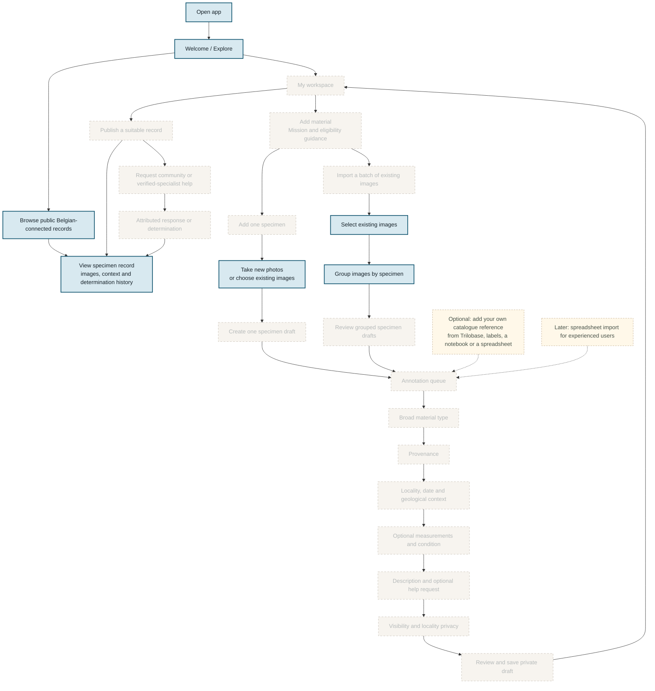

## Legend

- Blue, solid: implemented in the interactive prototype
- Orange, solid: implemented decision point
- Faded, dashed: planned for the frontend MVP

# Model

```text
ENTRY METHOD
│
├── Record one find
│   ├── Create one specimen draft
│   └── Take new photos or use existing photos
│
└── Batch import
    ├── Describe or choose a collection
    ├── Select existing images
    ├── Group images by specimen
    └── Review specimen drafts
                │
                ▼
SHARED SPECIMEN COMPLETION
│
├── Record type, where not known
├── Provenance
├── Find location and collecting context
├── Physical details
├── Description / request help
├── Privacy and visibility
├── Review
└── Save as draft

```

## Note

The diagram deliberately stops before:

- marketplace or sales;
- private messaging;
- reputation points;
- automatic identification;
- elaborate social feeds;
- institutional data publishing;
- collection CSV imports;
- advanced moderator tooling.

Those would expand the prototype beyond its purpose.

## Recommended handoff architecture

```text
My (frontend) responsibility
────────────────────────────────
React PWA
UX/UI
Forms and validation
Responsive behaviour
Accessibility
Frontend state
Mock service layer
API contracts
User-testing beta

Integration boundary
────────────────────────────────
findsService
authService
mediaService
determinationsService

Backend specialist responsibility
────────────────────────────────
Authentication
Database schema review
Access-control policies
Private location protection
Image permissions
Moderation authority
Audit and security controls
Production deployment
```

## Handoff point

This is a **frontend beta** with a replaceable data-service layer:

- complete responsive UI;
- all primary user journeys;
- realistic loading, empty, success and error states;
- form validation;
- image preview and upload UX;
- multilingual-ready interface structure;
- accessibility;
- seeded catalogue data;
- mock accounts and user roles;
- mock determination requests;
- API contracts and TypeScript types;
- a development database or mock API;
- frontend tests;
- documented expectations for the production backend.

## Backend implementation

I can deliver the complete frontend product experience and a realistic data-integrated testing environment.

**Production services** such as production identity, authorisation, privacy controls and backend security will require review and implementation by a suitably experienced backend developer.

- registration and login security;
- password recovery;
- account deletion;
- authorisation and role enforcement;
- scientist verification;
- Row Level Security policies;
- private exact-location protection;
- secure image access;
- moderation privileges;
- audit logging;
- rate limiting and abuse prevention;
- backups and recovery;
- GDPR-related deletion and data-export workflows;
- security testing.
