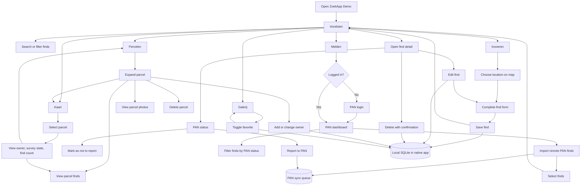

```mermaid
flowchart TD
    App[Open ZoekApp Demo] --> Vondsten[Vondsten]

    Vondsten --> Search[Search or filter finds]
    Vondsten --> Detail[Open find detail]
    Vondsten --> Invoeren[Invoeren]
    Vondsten --> Percelen[Percelen]
    Vondsten --> Kaart[Kaart]
    Vondsten --> Galerij[Galerij]
    Vondsten --> Melden[Melden]

    Invoeren --> MapPick[Choose location on map]
    MapPick --> Form[Complete find form]
    Form --> Save[Save find]
    Save --> Vondsten

    Detail --> Edit[Edit find]
    Edit --> Form
    Detail --> PANStatus[PAN status]
    PANStatus --> Report[Report to PAN]
    PANStatus --> Skip[Mark as not to report]
    Detail --> Delete[Delete with confirmation]

    Percelen --> ParcelDetail[Expand parcel]
    ParcelDetail --> Owner[Add or change owner]
    ParcelDetail --> ParcelFinds[View parcel finds]
    ParcelDetail --> Kaart
    ParcelDetail --> Photos[View parcel photos]
    ParcelDetail --> DeleteParcel[Delete parcel]

    Kaart --> SelectParcel[Select parcel]
    SelectParcel --> ParcelInfo[View owner, survey state, find count]
    ParcelInfo --> Percelen
    ParcelInfo --> ParcelFinds

    Galerij --> Favorite[Toggle favorite]
    Favorite --> Galerij

    Melden --> Login{Logged in?}
    Login -->|No| PANLogin[PAN login]
    PANLogin --> PANDashboard[PAN dashboard]
    Login -->|Yes| PANDashboard
    PANDashboard --> StatusFilter[Filter finds by PAN status]
    PANDashboard --> Import[Import remote PAN finds]
    Import --> SelectImport[Select finds]
    SelectImport --> Vondsten

    Save --> LocalData[(Local SQLite in native app)]
    Edit --> LocalData
    Delete --> LocalData
    Owner --> LocalData
    Favorite --> LocalData
    Import --> SyncQueue[(PAN sync queue)]
    Report --> SyncQueue
```
